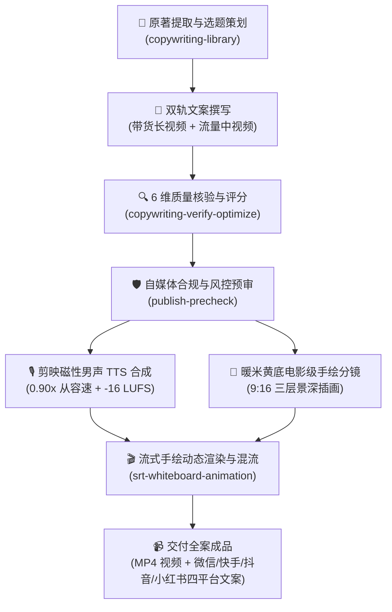

# 🎨 AI 内容创作技能套件 (AI Content Creator Suite)

> 面向 **微信视频号 / 快手 / 抖音 / 小红书 / 微信公众号** 的全流程 AI 视觉与音视频商业内容生产工作流工具包。  
> 涵盖 **选题策划 → 深度双轨文案创作 → 6维严格质检 → 国内自媒体风控预审 → 剪映播客级 TTS 配音 → 60fps 白板流式手绘动画渲染 → 四平台矩阵分发** 完整闭环。

---

## 📦 核心技能矩阵 (Modules)

```text
.
├── 📚 copywriting-library/          # 技能 1：文案素材库（双轨框架、视觉指南、分主题口播文案库）
├── ✍️ copywriting-verify-optimize/   # 技能 2：商业文案 6 维质检评分、事实核验与转化优化
├── 🛡️ publish-precheck/             # 技能 3：国内自媒体发布前风控自审与保意违禁词修复
├── 🎴 ai-quote-card-maker/          # 技能 4：爆款金句卡片 & 贴图故事号全套生成
├── 🎬 srt-whiteboard-animation/     # 技能 5：SRT 字幕驱动的 60fps 白板流式手绘动画引擎
├── 🎙️ tts-voiceover/                # 技能 6：剪映/火山引擎 VIP 播客级磁性配音与声画合成
└── 🎞️ native-subtitle-quote-image/  # 技能 7：原生字幕截帧与社交长图拼图工具
```

---

## 🔄 全流程生产闭环 (End-to-End Workflow)



---

## 🛠️ 模块详解 (Module Details)

### 1. 📚 [文案素材库 (`copywriting-library`)](./copywriting-library/)
- **双轨创作协议**：支持【深度带货款】（6~12分钟，深度认知重构+挂车促单闭环）与【爆款流量款】（2~4分钟，密集金句高完播）。
- **五阶递进模型**：黄金钩子 → 痛点共鸣 → 认知重塑 → 解决方案 → 赋能促单。
- **全案实战库**：沉淀《一个人的老后》等全套 10 大观点分章节逐字稿及全书 12 分钟全景大长篇。

### 2. ✍️ [文案审核与优化 (`copywriting-verify-optimize`)](./copywriting-verify-optimize/)
- **6 维商业质检体系**：事实可信度(25分)、共鸣与懂感(20分)、转化与逻辑(20分)、留存与互动(15分)、产品匹配(10分)、风控合规(10分)。
- 严格执行 ≥85 分放行门槛，杜绝虚假恐吓营销与编造家庭矛盾。

### 3. 🛡️ [发布风控预审 (`publish-precheck`)](./publish-precheck/)
- **多平台自审引擎**：覆盖微信视频号、抖音、快手、小红书最新违规限流规则。
- **保意精准替换**：对医疗绝对化用语、夸大宣传词、违禁词进行智能降级与同义保意修复。

### 4. 🎴 [AI 金句/故事卡片生成器 (`ai-quote-card-maker`)](./ai-quote-card-maker/)
- **全屏意境金句卡片**：星空/落日/山川唯美背景 + 优雅毛玻璃排版 + 电影台词中英双语设计。
- **贴图故事号矩阵**：单卡片故事贴图 + 深度公众号配套长文 TXT + 流量标签矩阵。

### 5. 🎬 [SRT 白板手绘动画引擎 (`srt-whiteboard-animation`)](./srt-whiteboard-animation/)
- **流式连续笔迹画法**：起笔墨线骨架追踪（`ink`） → 区域平涂上色（`color`），真实还原画手笔触。
- **叙事遮罩编排**：按叙事语义依次逐区揭示，支持 `protectedRegions` 重叠保护与持久画布。
- **可视化预览台**：内置 `preview.html` 本地 Web 预览台，支持拖拽标注框、时序微调与声画实时对齐。

### 6. 🎙️ [TTS 播客级配音与成片合成 (`tts-voiceover`)](./tts-voiceover/)
- **多引擎支持**：接入 **火山引擎（豆包语音）Seed-TTS 2.0 / Agent Plan**，全面支持剪映 VIP 官方同款【磁性男声】（`zh_male_m191_uranus_bigtts`）。
- **微沉浸调优**：内置 0.90x~0.95x 沉淀从容语速与 0.5s 开场静谧入场垫音，彻底解决开场急促感。
- **广播级响度**：内置 EBU R128 (`loudnorm=I=-16:TP=-1.5:LRA=11`) 动态响度标准化。

### 7. 🎞️ [原生字幕长图拼接 (`native-subtitle-quote-image`)](./native-subtitle-quote-image/)
- 将内嵌字幕视频按字幕精确帧裁切并拼接为社交平台长图，保留真实原片质感。

---

## 🚀 快速上手 (Quick Start)

### 1. 环境准备
确保已安装 Python 3.10+ 及 ffmpeg：

```bash
# 安装基础依赖
pip install requests pillow numpy opencv-python pydub imageio-ffmpeg python-dotenv
```

### 2. 配置 TTS 密钥
复制 `tts-voiceover/.env.example` 为 `.env`，填入你的 API 凭证：

```bash
cp tts-voiceover/.env.example tts-voiceover/.env
# 在 .env 中填入 VOLCANO_API_KEY (或 Seed-TTS Key)
```

### 3. 运行示例

#### 运行文案敏感词扫描：
```bash
python publish-precheck/scripts/scan.py --input "测试口播稿.md"
```

#### 运行白板动画流式渲染：
```bash
python srt-whiteboard-animation/scripts/render_stream_whiteboard.py --help
```

#### 运行声画字幕一键合成：
```bash
python tts-voiceover/scripts/srt_to_voice.py --help
```

---

## 🔒 开源合规与安全性
- 本仓库已配置严格的 `.gitignore` 机制，**绝不提交任何私有 API 密钥、密码、本地环境绝对路径、版权图书 PDF 及大体积音视频生成物**。
- 所有脚本均使用相对路径与动态环境变量设计，开箱即用。

---

## 📄 开源许可证 (License)
本项目基于 [MIT License](./LICENSE) 开源。
