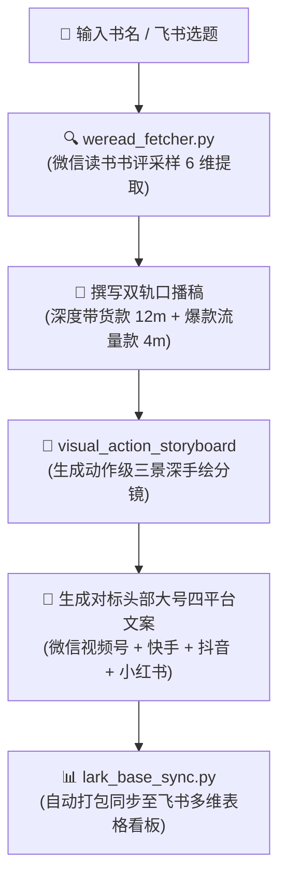

# 📚 图书带货文案素材库与智能创作引擎

从微信读书读者深度洞察出发，实现**“前置真实数据支撑 ➔ 双轨口播创作 ➔ 动作级分镜 ➔ 四平台矩阵文案 ➔ 飞书多维表格沉淀”**的完整创作流水线。

---

## 🔄 标准创作流水线

---

## 🛠️ 核心方法论与脚本

1. **微信读书读者洞察方法论**：`frameworks/weread_reader_insights.md`
   - 提取 6 大核心维度：`pain`（真实困境）、`scene`（具象场景）、`belief`（认知转变）、`language`（读者大白话）、`objection`（疑虑）、`outcome`（读后获得）。
2. **动作级视觉分镜标准**：`frameworks/visual_action_storyboard.md`
   - 拒绝抽象词，强制画面必须包含可被画出来的“具体动作与生活道具”。
3. **前置书评提取工具**：`scripts/weread_fetcher.py`
   - 运行：`python scripts/weread_fetcher.py --book "书名" --output "./topics/书名/"`
4. **飞书多维表格同步工具**：`scripts/lark_base_sync.py`
   - 运行：`python scripts/lark_base_sync.py --topic_dir "./topics/书名/"`

---

## 📦 双轨文案交付规范

每个主题产出标准 4 件套：
- `xx_深度带货口播稿.md`：11~13分钟，五阶递进，最后一幕手捧正版原著强促单；
- `xx_流量口播稿.md`：3~5分钟，10句清醒大实话密集金句，极高完播率；
- `xx_带货发布文案.md`：对标“我是老渔吖/豆包读书”同款 120~180 字真诚书评；
- `xx_流量发布文案.md`：短平快爆款文案，引导评论区互动与转发。
