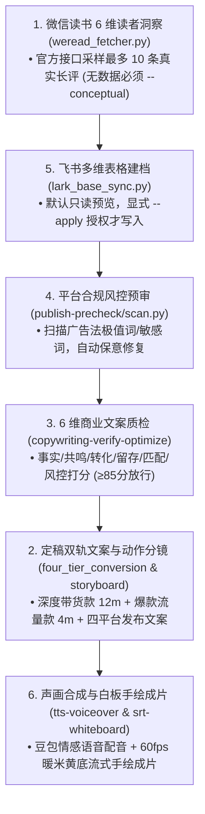

# 📚 图书带货文案素材库与智能创作引擎

从微信读书读者深度洞察出发，实现**“1.微信读书调研 ➔ 5.飞书看板建档 ➔ 4.合规风控预审 ➔ 3.6维质检打分 ➔ 2.终稿文案分镜 ➔ 6.声画合成出片”**的业务流水线。

---

## 🔄 标准生产流水线 (1.5.4.3.2.6 闭环)

---

## 🛠️ 核心方法论与脚本

1. **微信读书读者洞察方法论**：`frameworks/weread_reader_insights.md`
   - 提取 6 大核心维度：`pain`（真实困境）、`scene`（具象场景）、`belief`（认知转变）、`language`（读者大白话）、`objection`（疑虑）、`outcome`（读后获得）。
2. **四层递进带货法与生活毛刺细节规范**：`frameworks/four_tier_conversion.md`
   - 严格落实 **共情 ➔ 亏欠 ➔ 痛点 ➔ 出口** 四层递进；
   - 强制植入生活化毛刺细节（晨光揉腰、老花镜滑落、体检单划线）。
3. **前置书评提取工具**：`scripts/weread_fetcher.py`
   - 运行：`python scripts/weread_fetcher.py --book "书名" --output "./topics/书名/"`
   - 严格要求：无 API Key 且未提供真实文件时，必须显式携带 `--conceptual` 才允许概念推演，否则门禁阻断。
4. **飞书多维表格同步工具**：`scripts/lark_base_sync.py`
   - 运行：`python scripts/lark_base_sync.py --book "书名" --score 88.5 [--apply]`
   - 严格要求：默认 `--dry-run` 预览，携带 `--apply` 时才执行外部写库。

---

## 📦 双轨文案交付规范

每个主题产出标准 4 件套：
- `xx_深度带货口播稿.md`：11~13分钟，四层递进带货，最后一幕手捧正版原著强促单；
- `xx_流量口播稿.md`：3~5分钟，密集清醒金句，高完播率；
- `xx_带货发布文案.md`：120~180 字真诚书评；
- `xx_流量发布文案.md`：短平快爆款文案，引导评论区互动与转发。
