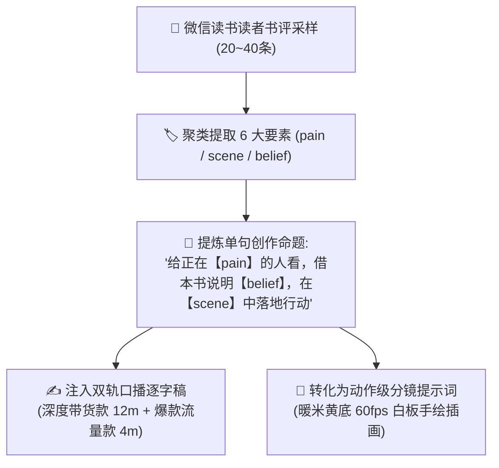

# 🔍 微信读书读者洞察与书评采样方法论 (WeRead Reader Insights Framework)

> 本规范提炼自头部爆款图书视频前置调研体系。  
> 核心原则：**不凭空捏造痛点，从真实读者的 20~40 条长评中提取原生语言、具象生活场景与认知转变，直接反哺口播与分镜！**

---

## 一、读者评论采样 6 大核心要素模型 (6-Dimension Review Extraction)

在为任何一本书撰写口播稿前，先从微信读书 / 豆瓣读书采样 **20~40 条有效读者点评**（按高赞推荐、最新点评与中立评价组合），提取以下 6 维信息并聚类：

| 维度代码 | 维度名称 | 定义与提取标准 | 实战示例（以《一个人的老后》为例） |
| :---: | :--- | :--- | :--- |
| **`pain`** | **真实困境** | 目标受众在现实中正在经历的心理重压、身份疲惫或焦虑 | “退休后带孙子累出一身病”、“生怕给儿女添麻烦”、“一辈子都在为家庭省吃俭用” |
| **`scene`** | **具象场景** | 可以在画面中被拍摄或画出来的具体生活动作与细节 | “十几年没穿过却舍不得扔的旧大衣”、“晨光中系着围裙做早饭”、“翻看泛黄老相册” |
| **`belief`** | **认知重塑** | 读者读前与读后的思想转变、顿悟金句 | “伴侣、子女是生命的同行者，不是终身避风港”、“生前把自己照顾妥当才是最大减负” |
| **`language`** | **原生大白话** | 读者在书评中自发使用的口语化、接地气的表达方式 | “句句戳心窝子”、“不跟你扯大道理”、“手中有闲钱、身边有搭子” |
| **`objection`** | **疑虑反驳** | 读者在阅读前可能存在的抗拒、偏见或不信任点 | “谈养老是不是不吉利？”、“一个人老去是不是很凄凉很可怜？” |
| **`outcome`** | **实际收获** | 读完后读者实际获得的从容感、底气或具体行动方案 | “放下了对变老的恐惧”、“准备把家里的储物间做一次彻底断舍离” |

---

## 二、从读者洞察到口播文案的转化机制



---

## 三、研究卡（Research Card）标准数据结构

每次完成前置调研后，在书籍素材目录生成 `research_card.json`：

```json
{
  "book": {
    "title": "一个人的老后",
    "author": "上野千鹤子",
    "rating": "8.6",
    "reading_count": "150000+",
    "core_tags": ["女性成长", "独居养老", "生活哲学", "生前整理"]
  },
  "reader_insights": {
    "top_pains": [
      "为家庭操劳一生后失去自我身份",
      "过度依赖养儿防老导致两代人精神内耗",
      "面对衰老时手足无措、缺乏自立规划"
    ],
    "concrete_scenes": [
      "老式厨房系着围裙忙碌的老母亲",
      "堆满旧衣服旧纸箱的储物间",
      "阳光通透的小公寓与阳台深呼吸",
      "咖啡馆与闺蜜相约画画喝茶"
    ],
    "mindset_shifts": [
      "独老从来不是凄凉，而是上天颁发给后半生的最高特权",
      "钱是铸造出来的自由，把死钱变成健康活钱"
    ]
  }
}
```
