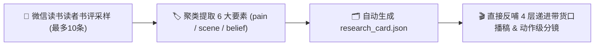

# 📖 微信读书 6 维读者洞察提取与应用方法论

> 核心原则：**不凭空捏造痛点，从真实读者的当前单次最多 10 条长评中提取原生语言、具象生活场景与认知转变，直接反哺口播与分镜！**

---

## 一、为什么必须先做读者调研？

在为任何一本书撰写口播稿前，先从微信读书 / 豆瓣读书采样 **当前单次最多 10 条有效读者点评**（按高赞推荐、最新点评与中立评价组合），提取以下 6 维信息并聚类：

1. **Pain（真实痛点）**：读者在现实生活中遇到了什么难以启齿的痛苦？（例：退休帮带孙子腰酸背痛、婚姻内毫无话语权）
2. **Scene（具象场景）**：读者在哪些生活画面里感受到了这种痛？（例：菜市场为了两块钱讨价还价、深夜关灯翻来覆去叹气）
3. **Belief（认知觉醒）**：读者读完后思维发生了什么 180 度大转弯？（例：不再把儿女当防老靠山，开始为自己存私房钱）
4. **Language（原生金句）**：读者留下的最具情绪杀伤力的口语大白话。（例：“我这辈子为所有人活，唯独忘了心疼我自己”）
5. **Objection（疑虑抗拒）**：读者买书前会有什么顾虑？（例：字太小看不清、会不会又是大道理鸡汤）
6. **Outcome（收获结果）**：读完后读者采取了什么具体行动？（例：第二天马上去做了体检、把家里的旧衣服扔了个精光）

---

## 二、调研流程与自动化消费

