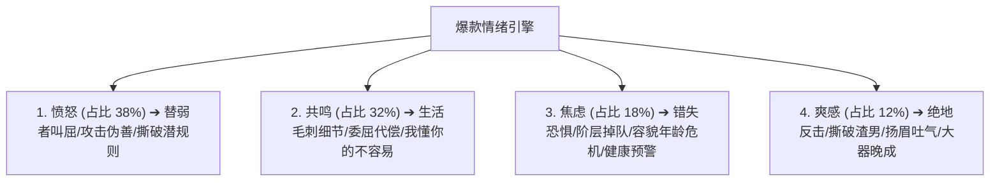

# 维度 1 · 选题方法论全景深度拆解指南

> **语料数据源**：`${CORPUS_ROOT}/pdf-corpus/` 中 956 篇百万级新媒体爆款文章全量数据。
> **核心定位**：解决“写什么话题最能引爆全网？”、“如何将普通生活小事转化为大众情绪核弹？”、“如何精准踩中读者的委屈与爽点？”。
> **报告规模**：全案深度剖析 · 包含 100 个即套即用选题模板与全量评估量表。

---

## 第一章：偏好话题类型规律深度剖析

通过对 956 篇爆款语料的大数据聚类，该博主的选题绝非随机漫步，而是高度聚焦于 7 大高频超级痛点品类：

### 1. 两性亲密关系与婚姻裂痕（占比 28.3% · 情感基本盘）
* **核心规律**：从不探讨抽象的“纯爱”，而是聚焦于现代婚姻中的“微小背叛、冷暴力、算计与失衡”。
* **典型真实文章标题**：
  * 《最高级的浪漫，就是柴米油盐鸡毛蒜皮》（2016-10-18）
  * 《凌晨两点，我翻完了老公的手机…》（2018-11-30）
  * 《大多数婚姻不是死于无性，而是死于无话》（2019-01-28）
  * 《周一围 _ 对老婆的态度，就是一个男人的人品！》（2018-11-20）
* **深层心理机制**：婚姻是所有成年女性最普遍的痛点发生地。通过揭露伴侣的敷衍与不体贴，给读者提供一个“我没有做错，错的是对方的不懂珍惜”的共鸣出口。

### 2. 职场生存、搞钱底气与反内卷（占比 15.3% · 阶层跃迁痛点）
* **核心规律**：严厉抨击“假大空的职场奉献精神”，极度推崇“硬核赚钱、不可替代性与体面离开的底气”。
* **典型真实文章标题**：
  * 《女人年轻的时候首先该干嘛？先挣钱！》（2016-03-12）
  * 《去你大爷，老子真的不想加班了！》（2019-01-29）
  * 《别人都在裁员，我们偏要高薪招招招招招招招人！》（2019-01-09）
  * 《最可怕的是，那些富二代比你还努力啊》（2016-04-05）
* **深层心理机制**：将金钱与“女性独立、人生尊严、婚姻退路”直接划等号，击中年轻群体的生存焦虑与阶层危机。

### 3. 人际边界、情商撕逼与远离烂人（占比 30.7% · 社交解气神器）
* **核心规律**：彻底打破中国传统熟人社会的“和稀泥”文化，旗帜鲜明地鼓励读者“立规矩、敢撕逼、远离消耗型老好人人设”。
* **典型真实文章标题**：
  * 《过度谈论自己的孩子，就是没修养》（2016-05-19）
  * 《如何对付爱搞暧昧的男人》（2016-02-14）
  * 《你支持的不是蒋劲夫，是家暴！》（2018-11-20）
  * 《参加同学会，我靠这个赢了白富美！》（2018-12-07）
* **深层心理机制**：替读者说出他们在现实中因顾及面子而不敢说的绝情话，提供极致的“代偿性爽感”。

### 4. 亲子育儿崩溃与家庭代际冲突（占比 10.7% · 宝妈情绪核弹）
* **核心规律**：撕下“伟大母亲”的圣母光环，将母亲还原为一个“会暴躁、会崩溃、需要私人空间”的真实普通人。
* **典型真实文章标题**：
  * 《老娘做了什么孽，要陪孩子写作业！》（2018-12-14）
  * 《连陪孩子的时间都没有，你成功个屁啊》（2016-04-28）
  * 《我们对父母，正在使用冷暴力》（2019-01-23）
* **深层心理机制**：精准刺破中国式家庭育儿中的“丧偶式育儿”与“作业焦虑”，让数百万疲惫的母亲抱头痛哭并疯狂转发。

### 5. 女性自我觉醒与容貌/年龄解绑（占比 6.9% · 悦己主义主张）
* **核心规律**：反对女性为了迎合男性审美而委曲求全，鼓励女性掌控身体自主权与消费自主权。
* **典型真实文章标题**：
  * 《俞飞鸿徐静蕾，凭什么40岁还能美成18岁！！》（2018-12-01）
  * 《长得丑该怎么办？》（2016-01-08）
  * 《我，一个矮子的史诗》（2016-03-01）
  * 《成为一个女神，到底要花多少钱？》（2016-02-22）

### 6. 社会公义、女性安全与弱者维权（占比 4.2% · 公共热点发酵）
* **典型真实文章标题**：
  * 《吴x波：当我小三吗？送你去坐牢的那种！》（2019-01-19）
  * 《是！家暴不是犯错，是犯罪！！！》（2018-12-02）
  * 《告诉孩子，野蛮是一口吐向天空的痰》（2016-03-18）

### 7. 极小代价生活自愈与日常解压（占比 3.9% · 治愈与生活方式）
* **典型真实文章标题**：
  * 《我用59块，续了自己一条命！！！》（2018-11-22）
  * 《只需200块，让你看起来年薪200万》（2019-01-10）
  * 《听说你最近不开心，那我讲一整年的笑话给你听！》（2019-01-11）

---

## 第二章：选题的情绪触发规律深度剖析

选题之所以能成为千万级传播，本质是其选题模型在开篇第一秒就击中了人类最底层的 4 大原级情绪：

### 1. 愤怒（Anger）—— 爆发力最强、即时转发率最高
* **触发机制**：寻找一个“施害者”（渣男、恶老板、不讲理的亲戚、道德绑架者）和一个“受害者”（读者自己或弱势群体）。
* **情绪公式**：`【极端不公的事实】 + 【受害者的隐忍委屈】 + 【作者代表正义的猛烈炮火】`
* **案例**：《你支持的不是蒋劲夫，是家暴！》、《去你大爷，老子真的不想加班了！》

### 2. 共鸣（Empathy）—— 留存时间最长、评论互动最深
* **触发机制**：不讲大词，只写那些“只有亲身经历过的人才懂的微小辛酸”。
* **情绪公式**：`【具体的晨起/深夜场景】 + 【被忽视的默默付出】 + 【一句懂你的清醒安慰】`
* **案例**：《老娘做了什么孽，要陪孩子写作业！》、《大半辈子风风雨雨，谁不是一边崩溃一边自愈啊！》

### 3. 焦虑（Anxiety）—— 促动点击率与商业转化最有效
* **触发机制**：戳破读者的虚假安全感，指出某种读者自以为高枕无忧但实际上正在崩塌的危机。
* **情绪公式**：`【虚假的安全现状】 + 【残酷的外部现实】 + 【紧迫的解决出口】`
* **案例**：《最可怕的是，那些富二代比你还努力啊》、《女人年轻的时候首先该干嘛？先挣钱！》

### 4. 爽感（Euphoria）—— 完播率与点赞率最高
* **触发机制**：让压抑的情绪在结尾得到 120% 的释放与反杀。
* **情绪公式**：`【前期的忍辱负重】 + 【关键时刻的一针见血】 + 【绝不原谅的潇洒离开】`
* **案例**：《参加同学会，我靠这个赢了白富美！》、《最高级的浪漫，就是柴米油盐鸡毛蒜皮》

---

## 第三章：选题切入角度的独门技法

同一件日常小事或社会热点，该博主之所以总能写出 10w+，核心在于其独特的 **“三维逆向切入法”**：

### 技法 1：颠覆道德绑架，将“伪善美德”打成“自我内耗”
* **大众切入**：“做人要大度，吃亏是福。”
* **博主切入**：“去你的吃亏是福，那些劝你大度的人，离他远一点，雷劈的时候会连累你！”（反常识逆向切入）

### 技法 2：将“宏大社会议题”降维到“个人一日三餐”
* **大众切入**：“论当代女性职场平等与社会经济结构演进。”
* **博主切入**：“年轻时别扯没用的，先去给我挣钱！手中有钱，你才有资格跟不喜欢的男人说滚！”

### 技法 3：从“指责受害者”反转为“痛击规则制定者”
* **大众切入**：“女人如何更好地平衡家庭与事业？”
* **博主切入**：“为什么从来没有人去问马云、马化腾如何平衡家庭与事业？平衡你大爷，老娘只想把眼前的事做好！”

---

## 第四章：时事热点与生活选题结合规律

1. **热点只做“由头”，情绪才是“本体”**：
   - 绝不花大篇幅报道新闻事实，前 150 字快速交代热点背景，随即立刻将热点事件抽象化为“全网每个人都可能遭遇的人性困境”。
2. **“三不过法则”**：
   - 热点发生不过 24 小时必须发稿；
   - 文章中引用热点事实不超过 30% 篇幅；
   - 结尾必须将热点收拢到读者的“日常生活决策”。

---

## 第五章：100 个可直接套用的爆款选题模板库

### 类别 A：两性情感与婚恋真相（模板 1 ~ 25）
1. 《别扯了，他不是【性格内向/工作忙】，他只是【没那么喜欢你】！》
2. 《大多数婚姻不是死于【出轨/贫穷】，而是死于【长期的无话可说】！》
3. 《最高级的【两性相处】，不过是【日常里的柴米油盐与小体贴】！》
4. 《凌晨【具体时间】，我终于看清了【枕边人】的真面目……》
5. 《对男人太好，往往是【女人一生委屈】的开始！》
6. 《不是他不解风情，是他把所有的【温柔与耐心】全给了【别人】！》
7. 《好的婚姻，一定要谈【钱/利益/底线】！》
8. 《那个把【脾气】留给你的男人，人品好不到哪里去！》
9. 《恋爱可以【风花雪月】，但结婚必须【算清这三笔账】！》
10. 《千万别和【天天向你诉苦/消耗你】的男人在一起！》
11. 《女人这辈子最该明白：伴侣只是同行者，不是你的【终身避风港】！》
12. 《所谓的模范夫妻，背后不过是【各自咽下的无数次委屈】！》
13. 《比起【物质出轨】，这种【精神冷暴力】才真正要命！》
14. 《他有多爱你，吵一次架就全知道了！》
15. 《真正高级的女人，从来不把【幸福】寄托在【男人】身上！》
16. 《为什么越是【懂事隐忍】的妻子，越容易被【辜负】？》
17. 《离开一个【消耗你】的人，是你人生最划算的投资！》
18. 《所谓门当户对，根本不是指家境，而是指【精神底色】！》
19. 《不要在【垃圾堆】里找男朋友，更不要在【深夜】做任何决定！》
20. 《你以为的深情，在他眼里不过是【廉价的纠缠】！》
21. 《别把【敷衍】当成直男，别把【自私】当成个性！》
22. 《婚前看【人品最低处】，婚后守【原则最底线】！》
23. 《一个家庭最大的内耗，就是【互相挑刺、彼此抱怨】！》
24. 《女人过得好不好，看她的【眼神和嘴角】就全知道了！》
25. 《如果一段感情让你【越来越卑微】，请立刻止损！》

### 类别 B：职场生存与财富跃迁（模板 26 ~ 50）
26. 《年轻的时候别谈【情怀】，先去把【硬实力和收入】提上来！》
27. 《去你的【吃亏是福】，老子凭什么给你免费当牛做马！》
28. 《不是你在一家单位有饭吃，而是你【去任何地方都有底气】！》
29. 《最可怕的不是别人比你聪明，而是【比你有钱的人比你还拼命】！》
30. 《别在最该【搞钱】的年纪，天天为【虚无的情感】伤春悲秋！》
31. 《所谓的职场老好人，到头来往往是【最先被淘汰的那一个】！》
32. 《手中有钱，心中不慌：这是成年人最高级的自律！》
33. 《职场不相信眼泪，只相信【不可替代的交付结果】！》
34. 《为什么那些【会来事、有边界】的人，反而升职更快？》
35. 《下班后的【两小时】，决定了你十年后的【阶层与自由】！》
36. 《千万别把【平台的资源】，当成你【个人的能力】！》
37. 《三十岁以后，你必须拥有【说走就走的身家底牌】！》
38. 《真正的敬业，不是无意义的加班，而是【高效解决核心问题】！》
39. 《少跟【负能量爆棚】的同事混在一起，贫穷也是会传染的！》
40. 《你所谓的稳定，不过是在【温水煮青蛙里慢慢等死】！》
41. 《不要在该拼命的年纪选择安逸，余生很贵，请别浪费！》
42. 《为什么你天天忙得焦头烂额，却依然【又穷又迷茫】？》
43. 《老板画的大饼再香，也抵不过【月底卡里多发的三千块】！》
44. 《学会这套【高情商拒绝术】，让你在职场少受80%的气！》
45. 《所谓的职场尊严，全是用【硬核业绩】砸出来的！》
46. 《月薪五千和月薪五万的人，差的根本不是时间，而是【认知模型】！》
47. 《别等裁员降临到头上，才发现自己【一无所长】！》
48. 《搞钱才是成年人最大的清醒，其余全是擦伤！》
49. 《职场社交的本质是【价值互换】，别把时间浪费在无用社交上！》
50. 《能用【钱】解决的问题，千万不要透支【人情】！》

### 类别 C：人际交往与情商边界（模板 51 ~ 75）
51. 《过度谈论你的【优越感】，在别人眼里就是【赤裸裸的没教养】！》
52. 《所谓高情商，就是【让人舒服的同时，绝不委屈自己】！》
53. 《远离那些【只会在微信上白嫖你专业】的所谓朋友！》
54. 《不要去叫醒一个装睡的人，更不要去拯救一个【习惯索取的人】！》
55. 《真正的绝交，从来都是【悄无声息的拉黑与远离】！》
56. 《别人尊重你，不是因为你老实，而是因为你【手里有刺】！》
57. 《少在朋友圈【晒这些东西】，除了招人嫉妒毫无意义！》
58. 《人际相处的第一原则：【关你屁事，关我屁事】！》
59. 《别把【尖酸刻薄】当耿直，别把【不知分寸】当幽默！》
60. 《那些劝你大度的人，你一定要【离他三米远】！》
61. 《成年人的社交潜规则：【没有明确答应，就是最体面的拒绝】！》
62. 《不要随便给任何人提建议，好为人师是人类最下等的欲望！》
63. 《看清一个人的人品，就看他【对服务员和下属的态度】！》
64. 《越是【关系好】的朋友，越要把【金钱和边界】算得清清楚楚！》
65. 《停止讨好所有人！你越是小心翼翼，别人越觉得你廉价！》
66. 《所谓知己，不是天天形影不离，而是【懂你的欲言又止】！》
67. 《不要向任何人倾诉你的苦难，80%的人不在乎，20%的人当笑话看！》
68. 《建立自己的【黑名单制度】：触碰底线者，一次不忠，百次不用！》
69. 《为什么有些人一开口，就让人想立刻【拉黑】？》
70. 《你的人缘变好，不是因为你变客气了，而是因为你【变强了】！》
71. 《少管闲事，多睡好觉：这是保命的两大神器！》
72. 《不要在【烂人烂事】上纠缠，你的时间比黄金还贵！》
73. 《高段位的人，都懂得在人际关系中【装傻与留白】！》
74. 《所谓合群，如果是为了迎合平庸，那我宁愿【孤芳自赏】！》
75. 《守住你的善良，但一定要让它【带点锋芒】！》

### 类别 D：家庭亲子与自我觉醒（模板 76 ~ 100）
76. 《老娘做了什么孽，要天天在【鸡飞狗跳】里陪孩子写作业！》
77. 《连陪孩子吃顿热饭的时间都没有，你谈什么【事业成功】！》
78. 《中国式父母最大的悲哀：【付出了一切，却养出了仇人】！》
79. 《我们对最亲近的人【使用冷暴力】，却对陌生人【格外客气】！》
80. 《父母尚在，人生尚有来处；父母去，人生只剩归途！》
81. 《别等儿女长大了，才发现你错过了他【最重要的童年】！》
82. 《最好的家庭教育，不是说教，而是【父母活成孩子的榜样】！》
83. 《大半辈子都在为父母活、为儿女活，你什么时候【为自己活一次】？》
84. 《凭什么女人一过四十岁，就必须被定义为【大妈和保姆】？》
85. 《我用【极小的代价】，彻底治愈了我内耗多年的心结！》
86. 《少买一件不穿的衣服，换下半生【精神自立、体面自由】！》
87. 《别再把【节俭】当成美德了，你省下的死钱，正在剥夺你的生活质量！》
88. 《真正厉害的女人，都懂得在晚年做好这【三项资产与精神准备】！》
89. 《原生家庭欠你的，请在下半生【加倍补偿给自己】！》
90. 《不要把人生的遥控器，交到【任何其他人】的手里！》
91. 《人过五十最清醒的活法：【屋子做减法，圈子做减法，心里做减法】！》
92. 《生闷气是一场慢性自杀，从今天起，谁让你不痛快你就让谁走开！》
93. 《你对生活所有的将就，最终都会变成【抽在脸上的巴掌】！》
94. 《真正的体面，是即便到了七八十岁，依然能把日子过得【活色生香】！》
95. 《心宽一寸，病退一丈：余生请学会对自己好一点！》
96. 《丢掉那些用不上的旧杂物，你的心灵才能【轻装上阵】！》
97. 《别等躺在病床上，才明白【谁才是真正靠得住的退路】！》
98. 《把期待从别人身上收回来，把精力放在自己身上，瞬间无敌！》
99. 《所谓的岁月静好，不过是有人在替你负重前行，现在轮到你爱自己了！》
100. 《愿你历经千帆，归来依然【眼里有光、手里有钱、心中有界】！》

---

## 第六章：选题评估标准（打分量表）

在正式动笔写任何一篇文章前，必须用以下 **5 维打分卡（满分 100 分）** 进行严格审查，≥80 分方可立项：

| 评估维度 | 权重 | 判定核心标准 | 达标分值 |
| :--- | :---: | :--- | :---: |
| **1. 痛感共鸣度** | 25分 | 读者看到选题是否会心头一紧？是否覆盖 ≥80% 目标人群的生活日常？ | ≥20分 |
| **2. 情绪爆发力** | 25分 | 是否能瞬间激起读者的愤怒、委屈、爽感或极度好奇？ | ≥20分 |
| **3. 观点颠覆性** | 20分 | 是否打破了某种传统常识或道德绑架？是否有反常识视角？ | ≥15分 |
| **4. 话题延展度** | 15分 | 中段能否轻松组织出 2~3 个真实的故事案例进行层层递进？ | ≥12分 |
| **5. 商业/转化落地点** | 15分 | 能否丝滑过渡到书籍、课程或产品，作为化解痛点的唯一出口？ | ≥13分 |

* ❌ **绝对放弃的负面选题**：
  * 抽象宏大空洞的纯理论分析；
  * 自嗨型个人无病呻吟；
  * 没有鲜明立场、和稀泥的两头讨好文；
  * 无法落地到读者个人利益的冷门技术文。
