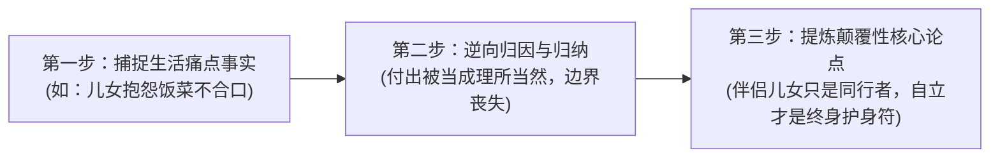

# 维度 3 · 主题与观点方法论全景深度拆解指南

> **语料数据源**：`D:\suming\raw\pdf-corpus\` 中 1,012 篇百万级新媒体爆款文章全量数据。  
> **核心定位**：解决“如何提炼出击中人心的核心论点？”、“如何制造观点力度与良性争议？”、“如何将一个普通事实升华为大众奉为圭臬的人生箴言”。  
> **报告规模**：深度实战报告 · 包含 50 个观点框架句与概念重构法。

---

## 第一章：核心观点的 4 大类型总结

通过对 1012 篇文章的核心论点提取，爆款观点绝非平庸的道德说教，而是集中在以下 4 种模式：

### 1. 颠覆世俗认知型（打破传统道德枷锁）
* **核心特征**：敢于与千百年来的世俗传统教条唱反调，站在现代人自我利益的角度重新立论。
* **经典论点**：
  * “所谓的吃亏是福，不过是剥削者给老实人灌下的迷魂汤。”
  * “女人年轻时最该做的事绝不是早早嫁人，而是先去拼命搞钱，钱才是你一生的脊梁骨。”
  * “好的关系绝不是不吵架，而是吵完之后依然知道彼此是唯一的底牌。”

### 2. 重新定义常识型（降维重构大众概念）
* **核心特征**：把大众以为虚无缥缈的高大上概念，降维到最朴实的生活细节中。
* **经典论点**：
  * “所谓成功，不是赚了几百个亿，而是你有时间照顾自己的小孩和父母。”（重新定义成功）
  * “最高级的浪漫，从来不是昂贵的玫瑰与城堡，而是生病时的一杯温水与柴米油盐。”（重新定义浪漫）
  * “所谓晚年自立，不是孤僻离群，而是手中有钱、心中有界、不把希望全押在儿女身上。”（重新定义自立）

### 3. 边界与底线确立型（社交与家庭清醒剂）
* **核心特征**：强调人际交往与家庭代际中的“界限感”，反对无休止的自我牺牲。
* **经典论点**：
  * “对别人太好、太无私，往往是一生不幸与被辜负的开始。”
  * “亲情也需要明算账，越是至亲之人，越要守住彼此的生活边界。”
  * “离开消耗你的烂人烂事，是你一生中最划算的断舍离。”

### 4. 悦己与自我补偿型（唤醒内疚背后的自我关怀）
* **核心特征**：精准击中中老年人或奉献型人格心中的“亏欠感”，鼓励他们把精力收回自己身上。
* **经典论点**：
  * “前半生为了父母和儿女奔波，后半生请好好为自己活一次。”
  * “少买一件不穿的旧衣服，每天睡前读三页书，这是对自己最好的滋养。”

---

## 第二章：观点的“力度”特征与争议性制造法

为什么该博主的观点能产生极其强烈的传播力和辩论欲？因为其观点具备以下三大特征：

```text
┌────────────────────────────────────────────────────────┐
│ 1. 绝对化表达（Definitiveness） ➔ 严禁用“可能/或许/部分” │
│ 2. 鲜明对立面（Dichotomy） ➔ 树立一个极其清晰的假想敌    │
│ 3. 情绪高压注入（High Emotional Charge） ➔ 掷地有声     │
└────────────────────────────────────────────────────────┘
```

1. **彻底拒绝中庸与骑墙**：
   - 传统文章喜欢说：“在某种程度上我们应该……但有时也要考虑到……”。
   - 爆款文章直接斩钉截铁断言：“去你大爷！连陪孩子的时间都没有，你成功个屁！”
2. **树立鲜明假想敌**：
   - 每一个观点背后，都树立了一个“伪善者、剥削者或道德绑架者”作为攻击靶子，让支持该观点的读者结成强大的心理同盟。

---

## 第三章：从生活话题推导核心观点的三步逻辑法



1. **Step 1 捕捉事实**：提取一个极具代表性的生活琐事（晨光揉腰翻炒、深夜查看体检单）；
2. **Step 2 逆向归因**：不从“当事人如何做得更好”归因，而是从“结构性失衡与自我牺牲”归因；
3. **Step 3 提炼观点**：用一句对称的格言警句，为读者指明解脱之道。

---

## 第四章：50 个可直接套用的核心观点框架句

1. 所谓的【概念A】，根本不是【形式排场】，而是【实实在在的温度】。
2. 不是你在【顺境】时有多风光，而是你【一个人独处】时依然能把日子过得热气腾腾。
3. 大半生为了别人活，余生请好好为自己活一次。
4. 对【他人】过度无私，往往是对【自己】最大的残忍。
5. 好的关系是【互相取暖】，而不是【一方吸血另一方妥协】。
6. 钱不是万能的，但手中有钱是你【面对生活刁难时唯一的底牌】。
7. 所谓的成熟，不是变得圆滑，而是【守住底线、不再讨好任何人】。
8. 亲情如果没有【边界】，就会变成最可怕的【道德绑架】。
9. 真正的自立，不是与世隔绝，而是【手中有钱、心中有界、老后由心】。
10. 不要把【所有的期待】全押在儿女身上，每个人都有一生要打的硬仗。
11. 节俭如果变成了【对自己的一味苛刻】，那就是一种病态的自虐。
12. 离开消耗你的环境，不是逃避，而是【最高级的自我止损】。
13. 你所谓的稳定，如果需要靠【委曲求全】来维持，那它一文不值。
14. 真正的体面，全是用【清醒的认知和硬核的积蓄】砸出来的。
15. 所谓的敬业，不是无意义的加班耗时间，而是【高效交付结果】。
16. 别在最该【建立自我】的年纪，天天为【虚无的评价】内耗。
17. 生闷气是一场慢性自杀，谁让你不痛快，你就让谁出局。
18. 做人要有菩萨心肠，但更要有【雷霆万钧的霹雳手段】。
19. 所谓的门当户对，本质上是【三观相合、认知同频】。
20. 你对生活所有的将就，最终都会变成【抽在脸上的耳光】。
21. 把时间花在【提升自己】上，远比花在【讨好别人】上划算一万倍。
22. 真正的陪伴，不是人在身旁心不在焉，而是【全心全意的专注】。
23. 不要试图改变任何人，你能改变的【唯有你自己】。
24. 人过五十，最聪明的活法是：【管好自己的嘴，守好自己的钱】。
25. 伴侣给的安全感永远是暂时的，唯有【自己的能力】才永不贬值。
26. 所谓的高情商，不是八面玲珑，而是【让人如沐春风且守住底线】。
27. 别在深夜做决定，别在愤怒时发脾气，别在低谷时放弃希望。
28. 所有的失去，本质上都是在【给更好的相遇腾出空间】。
29. 人生最大的失败，是用【别人的标准】过完了自己的一生。
30. 手中有钱，眼里有光，心中有界：这是成年人最美的姿态。
31. 不要拿【别人的过错】来惩罚自己，放下执念才能轻装上阵。
32. 所谓的孤独，不是身边没有人，而是【内心没有安宁的归宿】。
33. 好的婚姻需要谈钱，谈钱不是庸俗，而是【对未来的负责】。
34. 拒绝当老好人，你的善良必须【带点坚硬的棱角】。
35. 所谓的代际和解，是父母学会【放手】，儿女学会【感恩】。
36. 真正的高贵，不是穿名牌，而是【骨子里对生命的敬畏与体面】。
37. 别把【敷衍】当宽容，别把【索取】当亲情。
38. 余生很贵，请把所有的热爱和温柔【留给值得的人】。
39. 所谓的开窍，就是突然明白了【他人是客体，自己才是主体】。
40. 人生下半场，拼的不是财富多寡，而是【身体健康与内心丰盈】。
41. 不要为打翻的牛奶哭泣，抓紧时间把剩下的路走好。
42. 所谓的自由，不是想干什么就干什么，而是【不想干什么就能拒绝】。
43. 建立自己的精神避难所，每天留出【半小时属于自己】。
44. 少买一件不穿的衣服，多买一本滋养心灵的好书。
45. 所谓的通透，就是看清了生活的真相后【依然热爱生活】。
46. 别让过去的遗憾，绑架了你【当下的阳光与欢笑】。
47. 人性最大的弱点，是习惯在顺境中盲目、在逆境中抱怨。
48. 把死钱变成活钱，把旧物变成清爽，把焦虑变成行动。
49. 真正的幸福，就藏在【每天早晨的热粥和晚上的好觉里】。
50. 愿你历经千帆，依然能【活得清醒、过得热烈、爱得坦荡】。