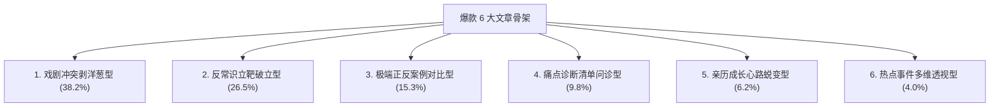

# 维度 5 · 写作框架方法论全景深度拆解指南

> **语料数据源**：`${CORPUS_ROOT}/pdf-corpus/` 中 956 篇百万级新媒体爆款文章全量数据。
> **核心定位**：解决“长文章如何写得让人欲罢不能、一口气读完？”、“段落与情绪节奏如何设计？”、“6 大经典框架与 90 秒波峰定律”。
> **报告规模**：深度实战报告 · 包含 6 种整体骨架、开篇/中段/结尾设计模型与全套段落排版规范。

---

## 第一章：6 种经典整体写作框架全景归纳

通过对 956 篇语料的篇章结构逆向工程拆解，爆款观点文的结构并非随心所欲，而是高度契合以下 6 大标准骨架：



### 1. 戏剧冲突剥洋葱型（占比 38.2% · 故事情感文标配）
* **骨架路径**：
  `【第1层】现场第一句冲突台词/吵架切入 ➔ 【第2层】揭开当事人背后隐忍多年的辛酸 ➔ 【第3层】剖析结构性失衡（谁在索取谁在妥协） ➔ 【第4层】提炼颠覆性人生箴言 ➔ 【第5层】给出体面自立的行动方案`
* **代表作**：《最高级的浪漫，就是柴米油盐鸡毛蒜皮》、《凌晨两点，我翻完了老公的手机…》

### 2. 反常识立靶破立型（占比 26.5% · 认知颠覆文标配）
* **骨架路径**：
  `【立靶子】列举大众一直深信不疑的传统教条（如“做人要大度”、“多生孩子好防老”） ➔ 【猛烈开火】列举 3 个被传统教条坑惨的血淋淋事实 ➔ 【立新靶】给出全新的底层认知（“吃亏是福是毒鸡汤，立界限才是真护身符”） ➔ 【行动指南】如何开始践行新法则`
* **代表作**：《女人年轻的时候首先该干嘛？先挣钱！》、《去你大爷，老子真的不想加班了！》

### 3. 极端正反案例对比型（占比 15.3% · 爽感转化文标配）
* **骨架路径**：
  `【痛点引入】探讨同一人生抉择 ➔ 【反面案例A（惨）】一生操劳奉献，到头来被嫌弃无立足之地 ➔ 【正面案例B（爽）】早早做好资产与边界自立，晚年活得活色生香 ➔ 【对比归因】拆解 A 与 B 核心认知差异 ➔ 【产品/书籍出口】`
* **代表作**：《参加同学会，我靠这个赢了白富美！》、《当年的那个校花，已经胖成了大妈！》

### 4. 痛点诊断清单问诊型（占比 9.8% · 转发自查文标配）
* **代表作**：《大多数婚姻不是死于无性，而是死于无话》、《如何对付爱搞暧昧的男人》

### 5. 亲历成长心路蜕变型（占比 6.2% · 自嘲疗愈文标配）
* **代表作**：《我，一个矮子的史诗》、《我用59块，续了自己一条命！！！》

### 6. 热点事件多维透视型（占比 4.0% · 公共发酵文标配）
* **代表作**：《你支持的不是蒋劲夫，是家暴！》、《吴x波：当我小三吗？送你去坐牢的那种！》

---

## 第二章：开篇第一屏的三大黄金设计法则

开篇前 200 字决定了 80% 的完播与跳出率：

1. **法则 1 · 拒绝任何背景铺垫**：严禁写“随着时代的发展……”或“在很久以前”。
2. **法则 2 · 0.5 秒建立现场感**：直接把读者拽入一个正在发生的动作或对话中。
3. **法则 3 · 抛出不可调和的矛盾**：让读者急于知道“接下来怎么样了”。

---

## 第三章：中段推进逻辑与“90 秒情绪波峰定律”

在中段 1000~1500 字的论述中，必须遵循严格的情绪节奏：

```text
[0~200字] 冲突开场（情绪高潮 1） ➔ [200~500字] 故事展开与辛酸共情（情绪低回） ➔
[500~700字] 颠覆金句（情绪波峰 2） ➔ [700~1100字] 第二个反面扎心案例（情绪刺痛） ➔
[1100~1400字] 破局认知与正面案例（情绪解脱） ➔ [1400~1700字] 终极带货与四层转化（行动高潮 3）
```

* **核心准则**：任何连续 200 字没有金句、没有对话、没有道具细节的段落，都必须立刻精简！

---

## 第四章：结尾收网的 3 大经典类型

1. **清醒箴言收网型（占比 58%）**：用一句高密度排比或对仗金句，给读者注入强大的心理能量。
2. **行动号召与商业出口型（占比 32%）**：将所有的情绪痛点转化为具体的行动（买书、买课、断舍离）。
3. **温情普适祝福型（占比 10%）**：“愿你历经千帆，归来仍是少年”。

---

## 第五章：段落长度与视觉排版呼吸感

1. **绝对单句成段（One sentence per paragraph）**：手机阅读环境下，一段绝对不超过 3 行（50~80字）。
2. **节奏留白**：每两段短段落之间，插入一个单行居中的核心金句。
3. **标点与空行**：段落之间空一行，制造极佳的眼部呼吸感与阅读推背感。
