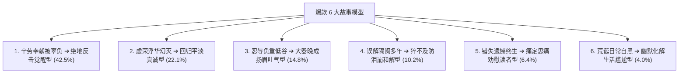

# 维度 8 · 故事结构方法论全景深度拆解指南

> **语料数据源**：`${CORPUS_ROOT}/pdf-corpus/` 中 956 篇百万级新媒体爆款文章全量数据。
> **核心定位**：解决“如何写出让人欲罢不能、边哭边转发的故事？”、“故事型文章的 6 大经典模型”、“50 个一秒抓人的故事开篇句式模板”。
> **报告规模**：深度实战报告 · 包含情绪过山车曲线、五感真实感微雕与故事过渡到观点的核心心法。

---

## 第一章：故事型文章的 6 大经典框架模型

在大数据语料中，故事绝非流水账，而是具有极其工整的“好莱坞三幕式变体”结构：



### 模型 1：辛劳奉献被辜负 ➔ 绝地反击觉醒型（占比 42.5% · 爆款第一模型）
* **故事弧光**：
  * **第一幕（隐忍与付出）**：主角（通常为勤恳母亲或全职主妇）数十年如一日操劳家务，晨光揉腰、节衣缩食，给所有人最好的照顾；
  * **第二幕（引爆与刺痛）**：一次突发事件或一句扎心台词（儿女嫌弃饭菜难吃、伴侣背叛冷漠、体检单亮红灯却无人问津），积压多年的委屈彻底引爆；
  * **第三幕（觉醒与反弹）**：主角彻底想通，不再委曲求全，扔掉旧杂物，拿回经济主权与生活边界，自己做减法，过上独立自在的清爽生活；
  * **第四幕（升华与带货）**：引申到原著书籍/产品，号召读者像主角一样及早觉醒。
* **代表作**：《最高级的浪漫，就是柴米油盐鸡毛蒜皮》、《一个人的老后》系列全案故事。

### 模型 2：虚荣浮华幻灭 ➔ 回归平淡真诚型（占比 22.1%）
* **代表作**：《参加同学会，我靠这个赢了白富美！》、《我买名牌包包全是被逼的！》

### 模型 3：忍辱负重低谷 ➔ 大器晚成扬眉吐气型（占比 14.8%）
* **代表作**：《最可怕的是，那些富二代比你还努力啊》、《做你喜欢的工作，还是世俗意义上的好工作？》

---

## 第二章：故事开篇的 4 大黄金手法

1. **手法 1 · 极度戏剧冲突人声台词开场（34.2%）**：
   * *“‘你要是再管我的事，你就从这个家里搬出去！’上周听到儿子摔门而出的这句吼声，六十二岁的张阿姨站在客厅中央，手里还拿着刚洗好的苹果，手抖得停不下来……”*
2. **手法 2 · 极度画面感生活微雕开场（13.1%）**：
   * *“早晨五点半，天还没亮透。厨房里的油烟机轰隆隆地响着，她系着那条洗得发白的碎花围裙，一边揉着酸胀发僵的后腰，一边急匆匆地翻炒着早餐……”*
3. **手法 3 · 深夜隐私窥探场景开场（18.5%）**：
   * *“凌晨两点，整个屋子安静得只能听到钟表的滴答声。她关了灯，坐在沙发角落，翻看着手机备忘录里记录的每一笔账单，翻着翻着，眼泪就掉了下来……”*
4. **手法 4 · 极端假设与生死危机开场（8.2%）**：
   * *“如果不是今天突然拿到这份盖着红章的体检报告，我可能还会继续像个陀螺一样，为了家庭操劳到死……”*

---

## 第三章：故事细节处理与“五感真实感微雕”

让故事从虚构走向 100% 真实的 4 项铁律：

| 维度 | 抽象虚假写法（严禁） | 五感微雕写法（标准） |
| :--- | :--- | :--- |
| **人物外貌** | 她看起来很沧桑苍老 | 戴着老花镜，两鬓白发被随便用塑料发卡别在脑后，手指关节粗大发红 |
| **家庭环境** | 她家里堆满了旧东西 | 阳台角落里塞满了舍不得扔的旧纸箱，衣柜顶上落着厚厚一层灰的旧鞋盒 |
| **消费习惯** | 她平时生活非常节俭 | 给儿女买几千块的补品眼睛不眨一下，去超市买两斤打折鸡蛋要排半小时队 |
| **心理崩溃** | 她心里觉得非常委屈 | 锅铲在半空中停顿了五秒钟，眼泪直接砸进热油锅里，滋啦一声冒了白烟 |

---

## 第四章：故事的情绪过山车曲线设计

```text
[0~10%] 悬念/冲突点（吸引注意） ➔ [10~30%] 默默付出的辛酸日常（共鸣与心疼） ➔
[30~50%] 矛盾彻底爆发与极端委屈（愤怒与叫屈） ➔ [50~70%] 痛定思痛与认知觉醒（破局爽感） ➔
[70~90%] 践行新生活方式的从容与底气（扬眉吐气） ➔ [90~100%] 呼吁读者采取同样行动（转化闭环）
```

---

## 第五章：从故事丝滑过渡到观点的“三步桥接法”

故事讲完千万不能生硬地说“这个故事告诉我们……”，必须使用**三步情感桥接法**：

1. **Step 1 读者镜像投射**：*“听完她的遭遇，你是不是也觉得，这分明就是在说我们身边的某个人，甚至就是我们自己？”*
2. **Step 2 痛点深度抽象**：*“中国有太多这样的女性，大半辈子为了家庭倾尽所有，唯独把自己排在了最后一位……”*
3. **Step 3 原著/金句出场**：*“其实早在多年前，日本学者上野千鹤子就在《一个人的老后》里一针见血指出了真相……”*

---

## 第六章：50 个一秒抓人的故事开篇句式模板库

1. 【具体时间/地点】，当【主角】听到【扎心台词】的时候，手里的【具体道具】猛地停在了半空……
2. 如果不是【偶然发现的某件物品/账单】，我可能永远都不会知道【背后的残酷真相】。
3. 凌晨【具体点数】，整个房间一片漆黑，【主角】一个人坐在床边，听着身旁【某人】平稳的鼾声，眼泪无声地流了下来。
4. 【主角】这辈子最擅长的事，就是【默默忍耐与妥协】，直到【极端冲突事件】彻底打破了平衡。
5. 早晨五点半，厨房里的水龙头哗哗流着，【主角】系着洗得发白的围裙，一边揉着酸痛的腰……
6. “【极具冲击力的第一句人声对话】！”上周听到这句话时，【主角】只觉得浑身发冷。
7. 给家里人花【高额金钱】从不眨眼，可去【具体场景】买【日常物品】，她却要挑拣半天。
8. 翻开那本已经泛黄的【旧账本/旧相册】，我终于看懂了【某人】这一生咽下的所有委屈。
9. 在别人眼里，【主角】拥有一个【看似完美的家庭】，可只有她自己知道，关上门后有多窒息。
10. 那天从医院拿回【体检单】，看着上面【红色的指标】，【主角】第一次决定为自己活一次。
11. 参加完【某次聚会/同学会】回到家，脱下外套的那一刻，【主角】心里突然空得发慌。
12. 结婚【具体年限】年，她每天都在【洗衣做饭伺候全家】，却在生病时连【一杯热水】都换不来。
13. “你还要我怎么样？！”面对【某人】不耐烦的质问，【主角】积压了二十年的怒火终于爆发了。
14. 阳台上堆满了舍不得扔的【旧箱子】，就像她心里那堆【放不下又理不清的旧恩怨】。
15. 很多女人年轻时都以为【真爱能抵挡万难】，直到步入中年才明白【手中的底牌才是唯一的退路】。
16. 看着镜子里那个【头发花白、眼神疲惫】的女人，【主角】突然问自己：我怎么会变成今天这样？
17. 【主角】是个典型的好人，可就是这个【从不拒绝别人的老好人】，最终活成了全家人的保姆。
18. 当儿女收拾行李搬进新房，把【主角】一个人留在老房子时，她终于看透了人情世故。
19. “我这辈子，到底图个什么呢？”深夜关了灯，【主角】常常这样自言自语。
20. 那天下午，【主角】做了一个全家人都觉得不可思议的决定：【一件重塑自我的大事】。
21. 刚退休那阵子，【主角】以为终于迎来了好日子，却没想到陷入了【更深的心累与内耗】。
22. 当伴侣把所有的耐心都给了【手机和外人】，留在客厅里的，只有无尽的冷暴力与沉默。
23. “妈，你别跟着瞎掺和了行不行！”儿媳这句脱口而出的话，让【主角】站在原地愣了很久。
24. 整理衣柜时翻出的【那件多年前心仪但没舍得买的裙子】，让【主角】彻底泪崩了。
25. 【主角】用了整整半生才明白：那些劝你大度的人，根本体会不到你心里的千疮百孔。
26. 如果人生可以重来，【主角】说她第一件要做的事，就是【早早学会为自己打算】。
27. 面对一桌子剩菜剩饭，【主角】习惯性地拿起了筷子，那一瞬间，她突然觉得无比心酸。
28. “我不是在和你商量，我是在通知你。”当【主角】第一次说出这句话时，全家都傻眼了。
29. 人过半百，【主角】终于狠狠心做了一次【断舍离】，把那些消耗自己的人和物全部清理出局。
30. 那天早晨送走最后一位客人，关上防盗门的刹那，【主角】瘫坐在沙发上，长长地舒了一口气。
31. 当初为了家庭放弃【事业/梦想】的【主角】，如今成了所有人眼里【没有价值的闲人】。
32. 看着存折上那笔【自己偷偷攒下的积蓄】，【主角】心里有了前所未有的安宁与底气。
33. “算了吧，都这把岁数了。”过去【主角】总把这句话挂在嘴边，现在她决定换个活法。
34. 那个曾经在职场上叱咤风云的女人，如今却在【儿孙的家务琐事】里耗尽了所有的光彩。
35. 走在深秋落叶铺满的小路上，【主角】第一次觉得，一个人的时光竟然可以如此美好。
36. “给别人做了一辈子饭，今天我想给自己做一顿好的。”【主角】系上围裙，眼神变得坚定。
37. 当【主角】不再随叫随到，全家人反而开始【小心翼翼地尊重起她的感受】。
38. 那些年为了家庭受过的窝囊气，如今想来，不过是【自己当初没有立好边界】。
39. 翻开这本改变她后半生的【好书】，【主角】一口气读到了天亮，把所有的心结都解开了。
40. “从此以后，我不欠任何人的，我只欠我自己。”【主角】在日记本上写下了这句话。
41. 当婆媳矛盾再次升级，【主角】没有像往常一样哭诉，而是【冷静地拿出了解决方案】。
42. 看着儿女成家立业渐行渐远的背影，【主角】终于释怀地笑了：我的任务完成了，现在轮到我了。
43. 那天在菜市场，【主角】第一次没有买打折菜，而是【买了一束鲜艳的百合花】。
44. “人生下半场，谁也指望不上，唯有握紧手中的底牌。”这是【主角】用血泪换来的教训。
45. 曾经以为离开谁就活不下去，现在【主角】一个人在阳台上喝茶看书，日子过得活色生香。
46. 当【主角】学会了适时放手，原本剑拔弩张的家庭关系，竟然奇迹般地和解了。
47. “别心疼那些旧东西了，心疼心疼你自己的余生吧！”闺蜜的一句话点醒了梦中人。
48. 从每天生闷气到每天笑逐颜开，【主角】的蜕变只因为做对了【这三项关键改变】。
49. 站在人生的十字路口，【主角】终于有勇气撕掉【全能保姆的标签】，做回真实的自己。
50. 每一个看似坚强独立的女人背后，都有一段【咬着牙把泪咽进肚里的觉醒史】。
